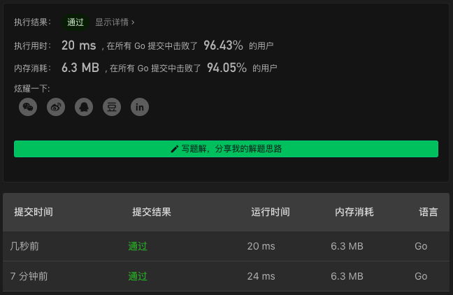

# 817. Linked List Components

链接：https://leetcode-cn.com/problems/linked-list-components/

## map 解法

1. 用 map 记录所有的 G
2. 遍历链表，查找链表中在 map 中存在且相邻的链表节点

```go
/**
 * Definition for singly-linked list.
 * type ListNode struct {
 *     Val int
 *     Next *ListNode
 * }
 */
func numComponents(head *ListNode, G []int) int {
    gs := make(map[int]struct{}, len(G))
    for _, g := range G {
        gs[g] = struct{}{}
    }

    nComp := 0
    for p := head; p != nil; p = p.Next {
        _, ok := gs[p.Val]
        if !ok { continue }

        nComp++
        for p = p.Next; p != nil; p = p.Next {
            if _, ok := gs[p.Val]; !ok {
                break
            }
        }
        if p == nil { break }
    }
    return nComp
}
```

## 解法效果



## 测试用例

```txt
[0,1,2,3]
[0,1,3]
[0,1,2,3,4]
[0,3,1,4]
[0,1]
[1]
[0, 18, 6, 7, 9, 13, 29, 1, 10, 19, 16, 32, 24, 8, 31, 11, 28, 2, 4, 20, 3, 27, 30, 23, 12, 22, 5, 17, 26, 15, 14, 33, 25, 21]
[22,23,31,1,20,2,32]
```

